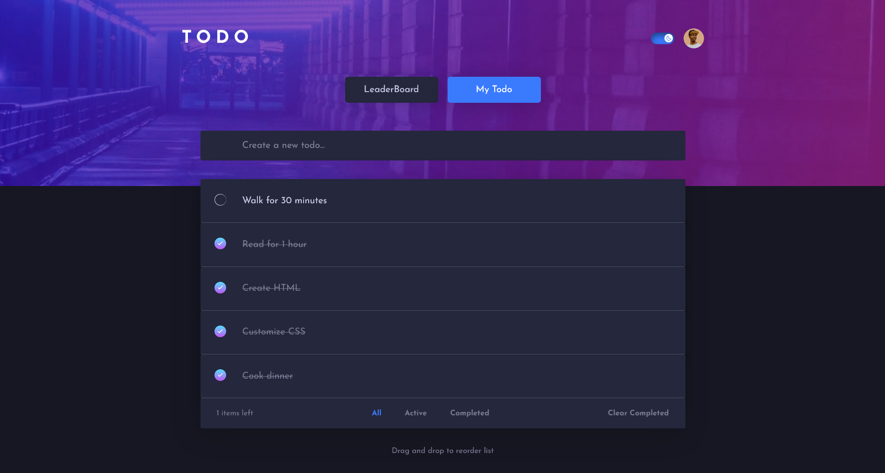

# Frontend Mentor - Todo app solution

This is a solution to the [Todo app challenge on Frontend Mentor](https://www.frontendmentor.io/challenges/todo-app-Su1_KokOW).

## Table of contents

- [Overview](#overview)
  - [The challenge](#the-challenge)
  - [Screenshot](#screenshot)
  - [Links](#links)

## Overview

### The challenge

Users should be able to:

- View the optimal layout for the app depending on their device's screen size
- See hover states for all interactive elements on the page
- Add new todos to the list
- Mark todos as complete
- Delete todos from the list
- Filter by all/active/complete todos
- Clear all completed todos
- Toggle light and dark mode
- Drag and drop to reorder items on the list
- See the 3 most active users
- Sign up/ Sign in using email and password or Google account
- Get password reset email if forgot password
- Upload avatar

### Screenshot

### Links

- Solution URL: [GitHub](https://github.com/xuanhung1509/todo-hub)
- Live Site URL: [Netlify](https://todo-hub-1509.netlify.app/) [Vercel](https://todo-hub-1509.vercel.app/)
